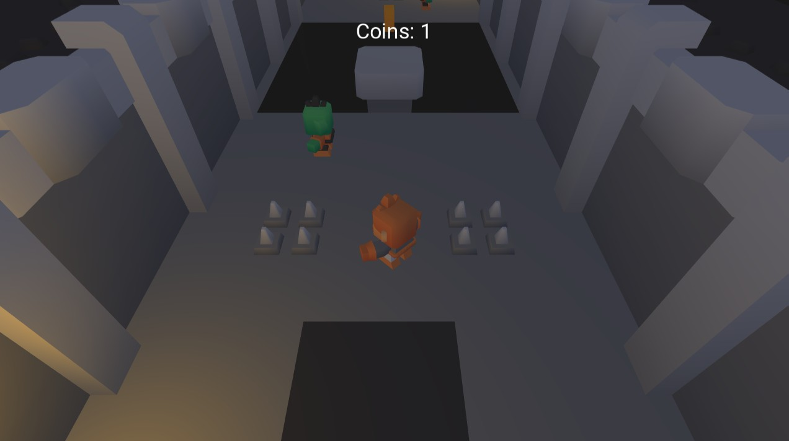
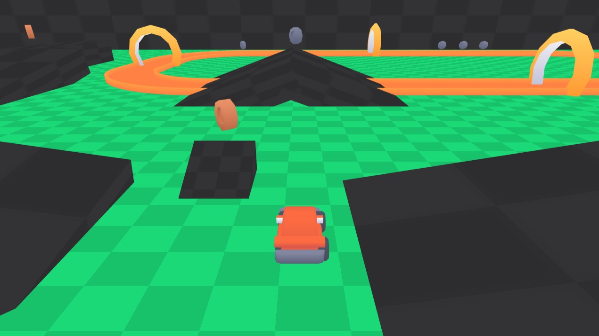
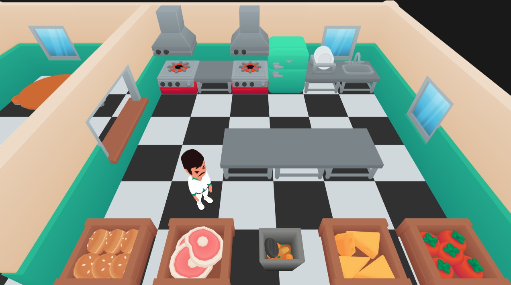

# Game project samples

3 samples of smalls games made with Xenity Engine are available to download on GitHub. 
Looking at the code is a great way to understand how the engine works. 
They all work on game consoles too. 

- [Dungeon platformer](https://github.com/Fewnity/Dungeon_Xenity_Game), it's a platformer in a dungeon. Use of physics, lighting, UI and audio. 

- [Nano Machines](https://github.com/Fewnity/Nano-Machines), it's a tiny car controller. Use of physics and particles. 

- [Cooking game](https://github.com/Fewnity/Cook_Xenity_Game), it's an Overcooked like. Use of physics, audio and particles. 
