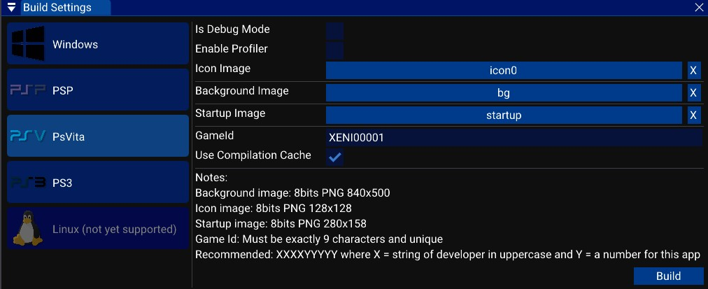

# Build settings

This menu allows you to build your game on various platforms such as Windows or PlayStation Portable. 

Each platform requires some settings and here are some of them:
- Is Debug Mode: This option enable more logs and a "DEBUG" preprocessor. This enable assertions too. Reduce performances. (Do not enable when shipping the game)
- Enable Profiler: This option enable profiling. You will be able to save profiling data into files. Reduce performances. (Do not enable when shipping the game)
- Icons/Image: You can chose an icon and images for the game. Game consoles use images to show the game in the game list.
- GameID: Game consoles use ids for their games. Each game has an unique ID.
- Use Compilation Cache: Improve compilation speed by reusing compiled code from previous builds. Disable this option if you notice weird behavior in builds with your code.

Some rules about GameID and images are in the notes part. Respect them.

There are two builds button (not for all platforms):
- Build: Ask for a path, build the game and save the binaries in the selected folder.
- Build and Run: Ask for a path, build the game and save the binaries in the selected folder and start the game. (The game will start in a emulator for game consoles).