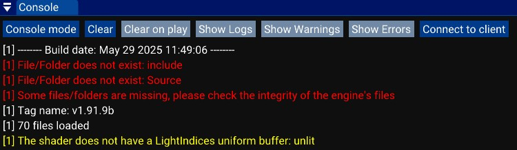

# The console

The console window displays messages, warnings, and errors from both the game and the editor. 
It helps you debug your game and understand any issues that occur within the editor.

There are 3 types of messages:
- Log: Informational messages that are not critical. These messages are mostly used for general feedback, such as successful loading of assets or routine operations.
- Warning: Indicates a potential issue that does not stop the game or editor from running, but might lead to problems if ignored. Warnings should be reviewed and addressed when possible.
- Error: Critical issues that usually prevent something from working correctly. Errors often stop certain systems from functioning and should be fixed immediately to ensure the game or editor runs properly.

Here is the list of buttons:
- Console mode/List mode: Console mode will show all messages without colors and ordered from the oldest to the newest message. List mode enable color and collaps identical messages.
- Clear: Remove all messages from the console.
- Clear on play: Remove all messages from the console when launching the game.
- Show Logs: On/Off button to list or not logs in List mode.
- Show Warnings: On/Off button to list or not warnings in List mode.
- Show Errors: On/Off button to list or not errors in List mode.