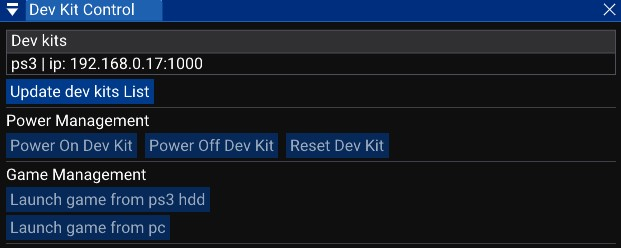

# Dev kit control

If you are an owner of a PlayStation 3 dev kit, this menu can be useful for you. 
This window provides a way to control a dev kit using official PS3 tools. (Softwares not included with Xenity Engine).

The Dev kits list shows every registred dev kit in Target Manager. 
The `Update dev kits list` button will launch Target Manager and get the list of dev kits. 
Then you can click on the dev kit to use. 

### Power Management

You can turn on or off your dev kit from the editor. 
If you want to leave the game you can reset the dev kit.

### Game Management

If the game's files are located on the dev kit hard drive, you can launch it with the `Launch game from ps3 hdd`. This option is useful with fake dev kit (retail PS3 running dev kit firmware). The file should be located in `/dev_hdd0/xenity_engine/XenityBuild.self`.

If the game's files are on your computer, you can launch it with the `Launch game from pc`. This option only works with an official PlayStation dev kit. You have to select the .fake.self file.