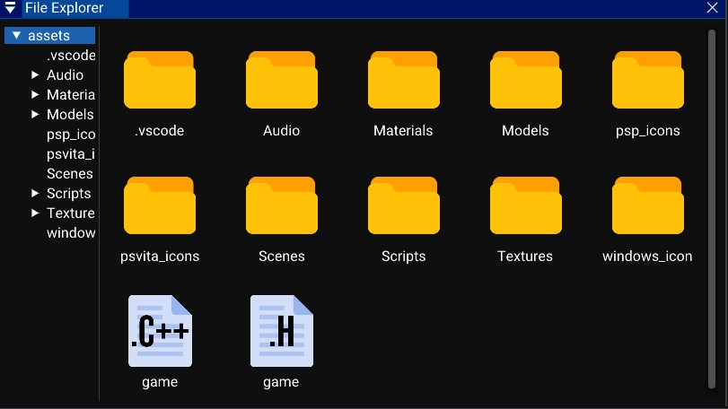

# The file explorer

Ther file explorer Window show all the files of your opened project.  

### Manage files

- You can double click on folders to open them or use the folder list on the left.
- To move a files you can drag it into a folder.
- To manage a file, you can right click on it and you will see a list of command (delete, rename...).
- You can right click the back of the file explorer, and you will see a list of commands (Create files, open folder in explorer...).