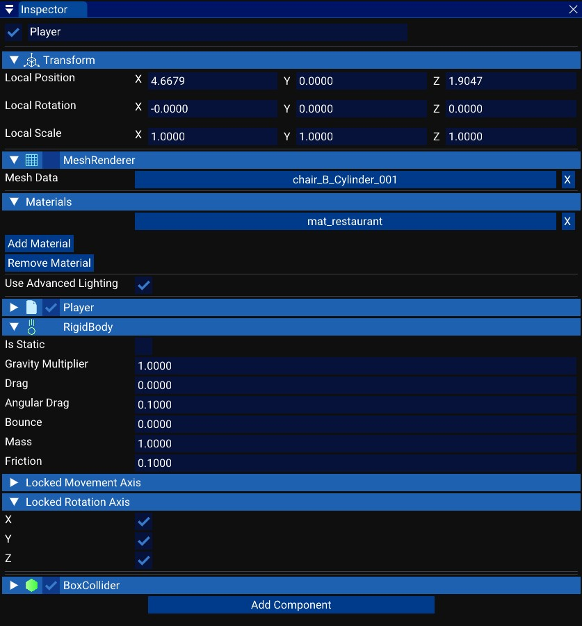

# The inspector

The inspector window lists all components of a [GameObject](../../script_api_reference/engine/gameobject/gameobject.md).

You have the name of the GameObject and a check box to enable or disable it. 
Then the [transform](../../script_api_reference/engine/components/transform/transform.md) of the GameObject that contains the information about the position, rotation and scale. 
And finally you have the list of components, you can add new, edit or delete them. 
Most components have a check box to enable or disable them.

