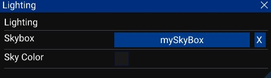

# Lighting settings

The lighting settings window show all lighting settings related to the scene.

### Options:
- Skybox: Set a [skybox](../../script_api_reference/engine/assets/skybox/skybox.md) for the scene.
- Sky Color: Set the color if the sky if no skybox is set.