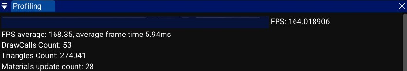
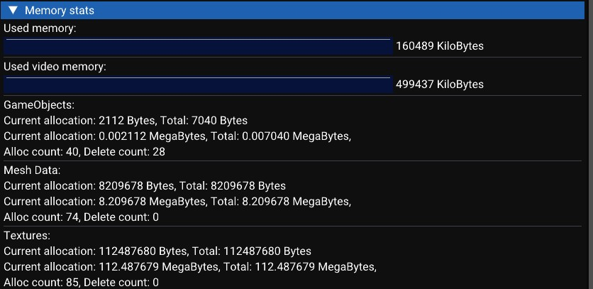
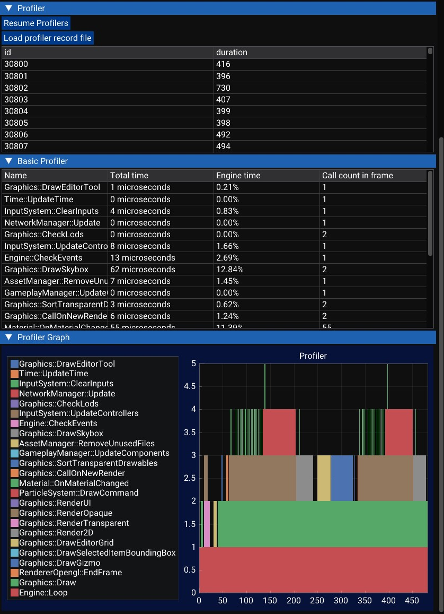

# The profiler

The profiler window provides you informations about the performances of your game and of the engine.

In the first part of the profiler, you can see basic information:
- FPS graph: The graph shows the number of frame per seconds. stable graph and high numbers are better.
- FPS average: The average number of frame per seconds. Higher is better.
- DrawCalls Count: When a submesh is rendered, it adds one to this counter. Lower is better, especially on older game consoles.
- Triangles Count: The number of rendered triangles. Lower is better.
- Materials update count: This counts how many times a material has been updated, specifically when its uniforms are modified before rendering. Lower is better.

In the second part of the profiler, show the memory consumption of the engine. 
- Used memory: It's the RAM usage (Components, audio clips...).
- Used video memory: It's the RAM usage of the graphics card (FrameBuffers, Textures, Meshes...).

There are some categories (GameObject, Mesh Data and Textures).
- Current allocation is the amount of memory used at this moment.
- Total is the amount of memory allocated since the beginning.
- Alloc count is the number of created objects since the beginning.
- Delete count is the number of deleted objects since the beginning.

Mesh Data and textures are the most important, for example the PSP only have 2MB of video memory. If the PSP is running out of VRAM, the RAM is used instead of textures and mesh data, but it's slower.

In the third part of the profiler, you can see a list of frame. Each frame is recorded (in a limit of 400 frames). 
You can select the frame by clicking on the element in the list.
You will see the profiling data in two forms:
- A simple list of C++ functions with the total CPU time used by them.
- A graph that draw each call.

You can pause the profiler with the button to read the value and you can load a profiler record file if you want to profile a build outside the editor.

