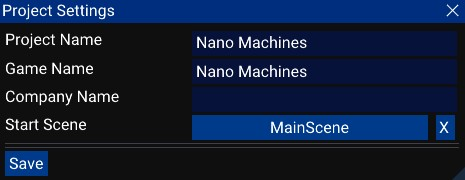

# Project settings

The project settings window show all settings related to the project. 
Each projet has it's own settings.

### Values:
- Project Name: The name of the project, used by the [project manager](./project_manager.md).
- Game Name: The name of the game, used in builds.
- Company Name: The name of your company. Can be your user name if you don't have one.
- Start Scene: The scene to load when the project is loaded. Used in builds. Should not be empty!