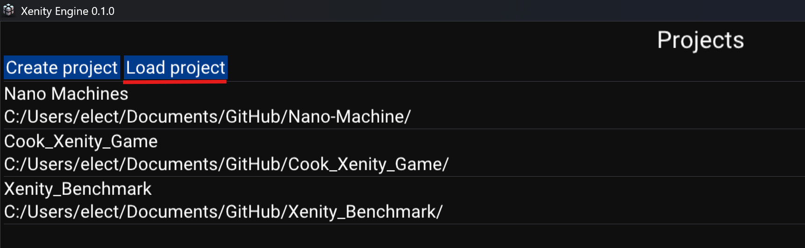
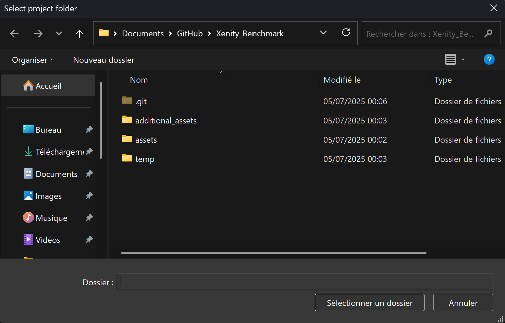

# How to add an existing project

If you have a folder containing a Xenity project and the project is not listed in the project list, you can add it.

If you want, there is a list of project samples that you can download, see [Game Project Samples](../../game_project_samples/game_project_samples.md).

First click on the `Load project` button:

And select the folder of the project, this folder should contains the `asset` folder.

Then the project will load and will be added to the project list.