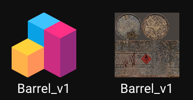
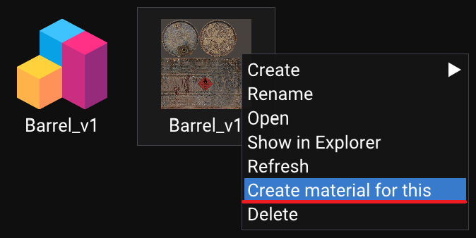
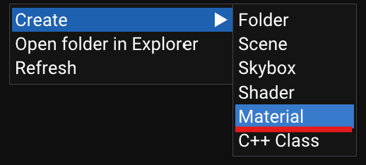
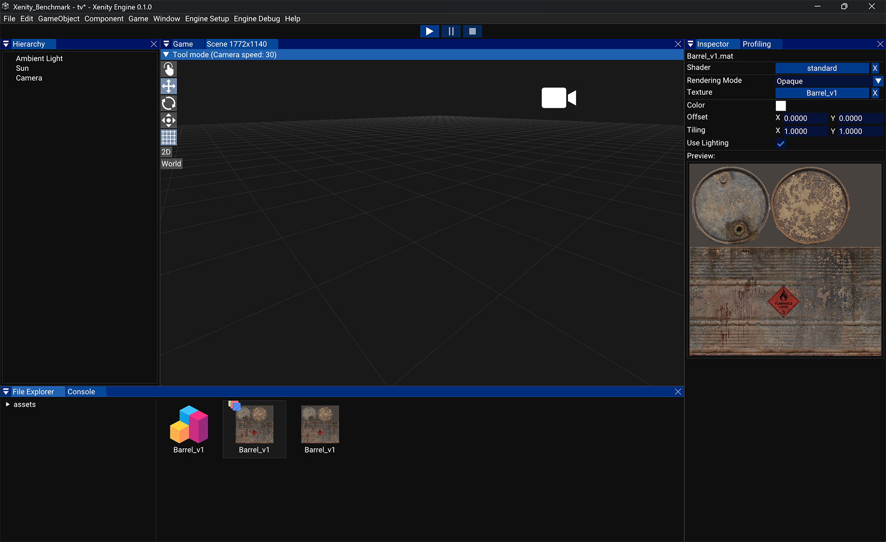
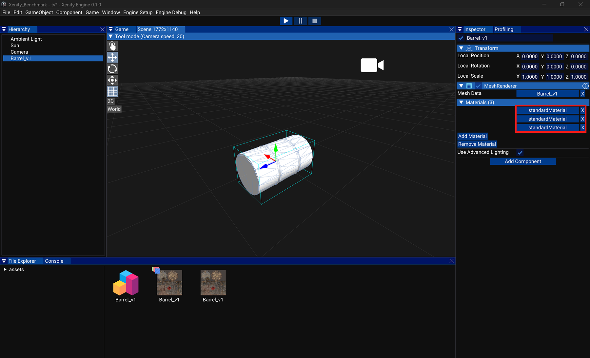
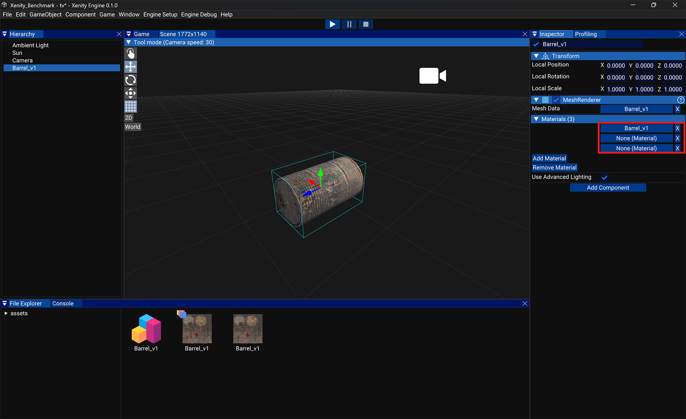
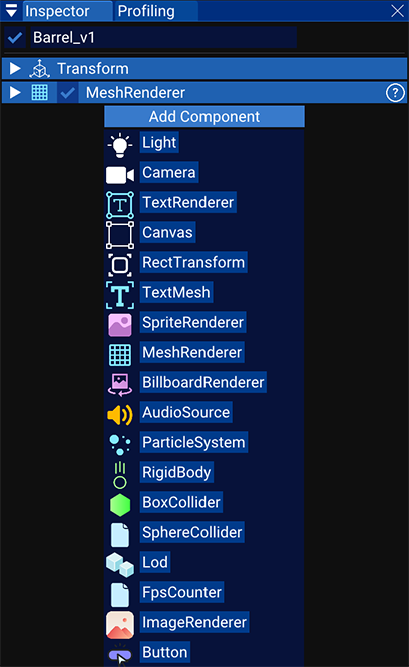

# Add your first object in the scene

Once you have a mesh and a texture, you are almost able to use them in your scene.

You need a material for your mesh. To create one, you can right click on your texture and click on `Create a material for this`:

Or you can create an empty material by right clicking on the background and by clicking `material` in the `Create` menu:

Then you will have a new material. Use the Standard shader if you want to use lighting, or use the Unlit shader if you want a bright texture without lighting. Unlit has way better performances.

Then you can drag and drop your mesh into the scene and set the material in the materials list of the mesh renderer.

There are two ways to change a material variable:
- Drag and drop the asset into the slot,
- Click on the slot to show the list of asset and double click on the asset you want to use. 

Each material slot is a material for a submesh. This mesh has 3 submeshes.

I'm only applying a material to one submesh because other submesh are LODs.

And now if you want, you can add more components to your GameObject by clicking `Add Component`:

