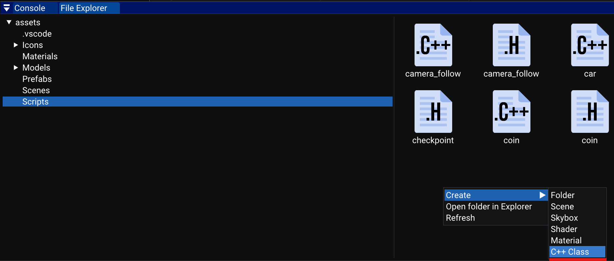
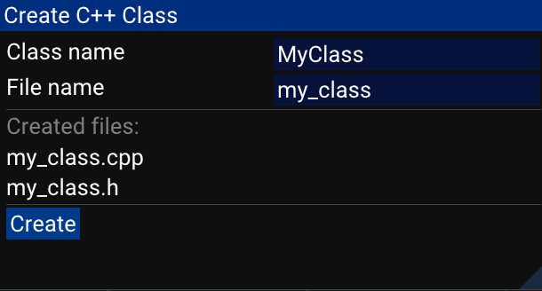
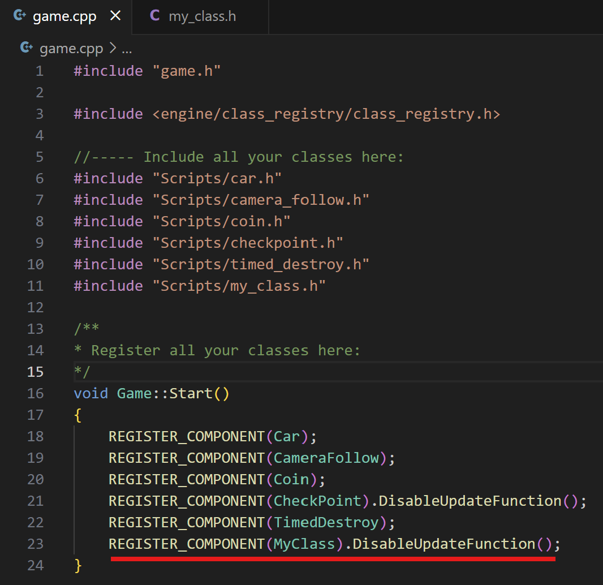

# How to create a component

Xenity provides a simple way to create a component for your game.

First, make a right click on the background of the file explorer, then click on Create C++ class:

Then a menu will ask for information about the new class:
- Class name,
- File name.

If you modify the class name, the file name will be automatically updated with the new name.

And finally, the engine needs to know that this class exists. For this, you have to open game.cpp and add two lines:
- An include to the file,
- A REGISTER_COMPONENT call.

REGISTER_COMPONENT allows you to add parameters about this class, for example the DisableUpdateFunction will prevent the engine from calling the Update function every frame.

> [!WARNING]
> Do not move or delete the game.cpp and game.h file, or your project won't work anymore.