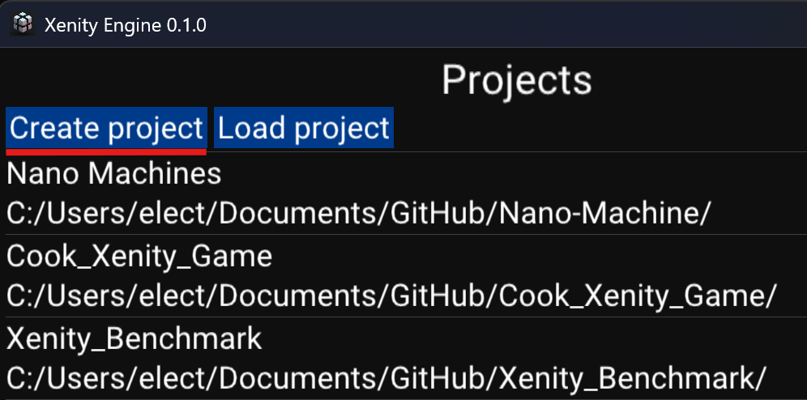
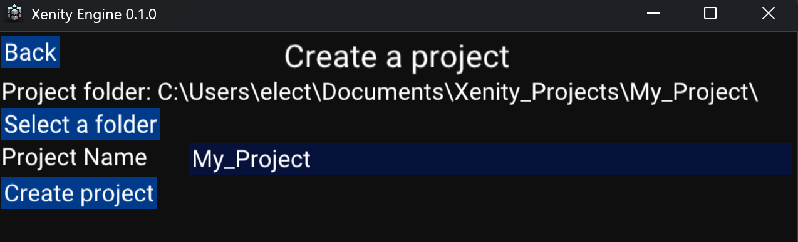

# How to create a project

With Xenity you can work with multiple projects. If you don't have one, let's create one.

Click on `Create project`:

This will show a new menu asking for two info:
- Location of the project,
- Name of the project.

By default the project location is `User/Documents/Xenity_Projects/` but if you want you can select a new folder.

Then you can finally click on `Create project`.