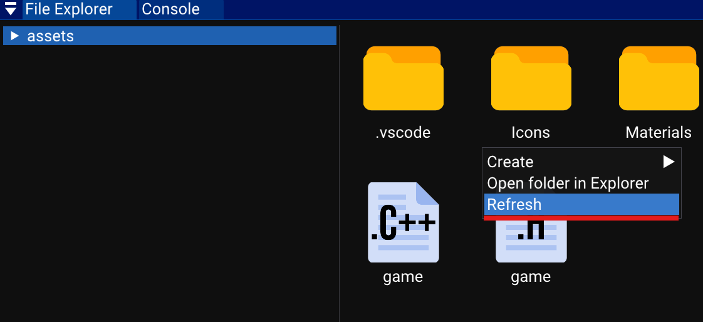

# How to import files

To add files to your Xenity project, you simply have to drag and drop files or folders into the File Explorer.

You can also add files using the Windows file manager into the asset folder of your project. You may have to refresh the file explorer by right clicking on the background and then click on `Refresh`.

See [Compatible asset formats](../compatible_asset_formats.md).