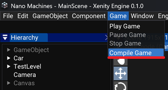

# How to play your game in the editor

Xenity allows you to test your game directly in the editor.

For this, you have to compile the code of your game to be able to use scripts you have made.

To compile, open the `Game` tab and click on `Compile Game`.

Each time you change you game code, you have to compile to apply changes.

You can compile while playing your game, the editor will reload the current scene, but this feature may not work properly. (Heap created by components won't be restored, only reflected variables will be restored).