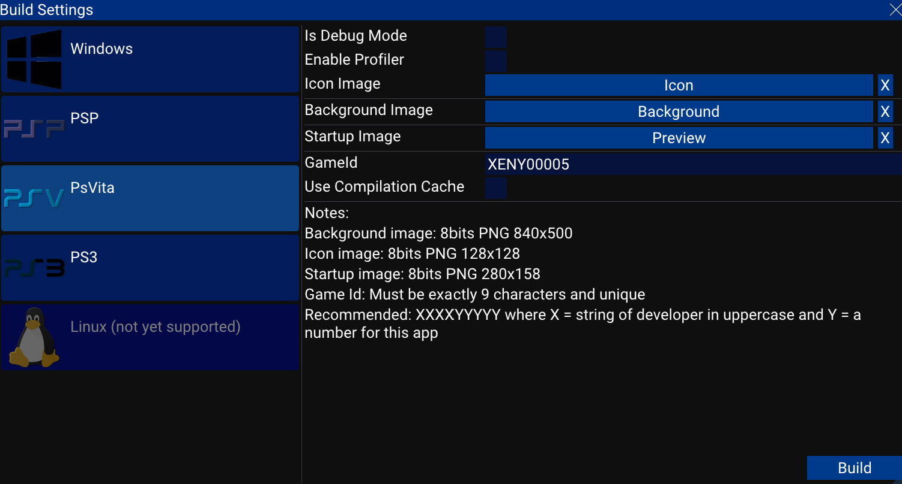

# How to play your game on game console

First of all, to run a homebrew made with Xenity, you need a jailbreaked game console.

It's highly recommended to test your builds on real hardware before publishing your game. If you cannot test, you can ask to some people on homebrew discord servers to test them or ask me.

To build a game on game console, you have to setup Docker, see [Game Console Installation](../../installation/game_console_installation.md).
Then you can check the [Build Setting Menu](../editor_ui/build_settings.md), it's the menu to use to make builds.

Preview of the build menu:

Each game console has a special executable file.

- On PSP it's an EBOOT.PBP file, it will directly launch the game.
- On PsVita it's a .vpk file, it will install the game, asset files are in the .vpk file.
- On PS3 it's a .self, it will directly launch the game.

## Emulation

You can try your game on emulator, but it's not recommended to check performances with them, a game can run smoothly on an emulator but run poorly on real hardware or not even boot! Sometimes emulators won't crash if you code has a bug.

- For PSP you can use [PPSSPP](https://www.ppsspp.org/).
- For PS3 you can use [RPCS3](https://rpcs3.net/).
- No working emulator for PsVita is available.

## Running on real hardware

### PSP

Put the game build folder in the GAME folder of your PSP memory stick then you should see a new game in the game list.

The log file is located next the the EBOOT file.

### PsVita

#### Setup

Xenity games needs some setup to run on a PsVita. The libshacccg.suprx file needs to be extracted and decrypted. This file is needed to enable the shader compiler. This setup has to be done only once.

You can follow [this tutorial](https://cimmerian.gitbook.io/vita-troubleshooting-guide/shader-compiler/extract-libshacccg.suprx).

#### Install the game

Put the .vpk file on the memory card of your PsVita (using FTP or USB), then launch [VitaShell](https://github.com/TheOfficialFloW/VitaShell), find the .vpk file and press X to install. Confirm the next popup about security. Then a new bubble with the icon of the game should pop on the main PsVita screen.

### PS3

Put the game build folder on the hard drive of your PS3 using FTP or put the game folder on an USB key, then launch [MultiMan](https://store.brewology.com/ahomebrew.php?brewid=24) (or another software that can launch .self files) and launch the .self file. If you have a .fake.self file, it's only used by devevelopment kits, you can delete this file if you don't have one.

The log file is located next the the .self file.