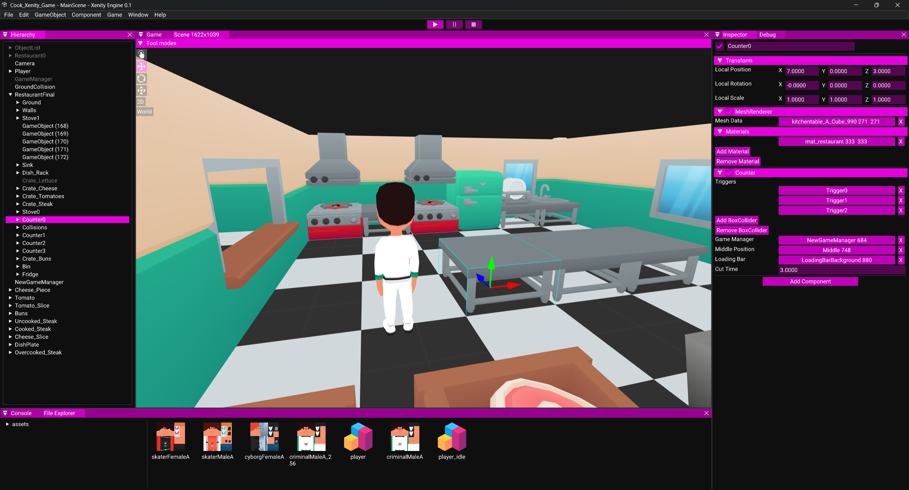

# Presentation of Xenity Engine

Xenity Engine is a crossplatform game engine based on GameObjects and Components for PlayStation Portable, PsVita, PS3 and Windows.

### Supported platforms: 
✔️ Supported 
🚧 Work In Progress 
❌ Not Supported Yet 

| Status | Platform |
|-|-|
✔️ | Windows
✔️ | PlayStation Portable
✔️ | PlayStation Vita
✔️ | PlayStation 3
🚧 | Linux (The UI is a bit glitchy, missing audio and build system)

Features:

- [X] Basic 2D
- [X] Basic 3D
- [X] 2D Audio
- [ ] 3D Audio
- [X] Skyboxes
- [X] Scenes
- [ ] Animations
- [X] 3D Physics
- [ ] 2D Physics
- [X] C++ Hot Reloading

> [!WARNING]
> The engine is not perfect. So you may encounter problems during game development like:
> - Deleting Meta files will have repercussions on your project. Variables that reference the files will be emptied.
> - Duplicating a meta file will cause problems, each meta file has a unique file id in it.
> - Audio works "fine" with 44100Hz but on PS3 you need to use 48000Hz audio.